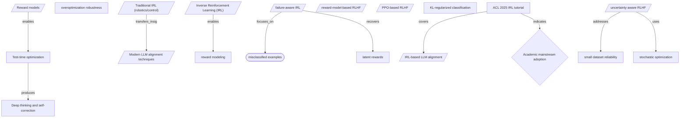

# **Enriched Research Goal:**

Design and evaluate agentic AI systems for automated detection of webapp vulnerabilities through offensive techniques with unrestricted tool access. Focus on recent AI capabilities and emerging methods for identifying user enumeration, account takeover, IDOR, RCE, and defacement attacks. Provide deep technical implementation details suitable for building production-grade vulnerability discovery systems, including agent architecture, tool orchestration, exploitation strategies, and defense mechanisms.

*Deep Research Report*

---

**Generated:** January 24, 2026 at 01:13
**Session ID:** b439d3a

---

## Table of Contents

- [1. Executive Summary](#1-executive-summary)
- [2. Introduction](#2-introduction)
- [3. Agentic AI Architecture Patterns and Framework Evolution](#3-agentic-ai-architecture-patterns-and-framework-evolution)
- [4. Vulnerability Landscape and Attack Vectors for AI Agents](#4-vulnerability-landscape-and-attack-vectors-for-ai-agents)
- [5. Autonomous Penetration Testing Systems and Implementation](#5-autonomous-penetration-testing-systems-and-implementation)
- [6. Security Standards and Regulatory Framework Development](#6-security-standards-and-regulatory-framework-development)
- [7. Production Deployment Challenges and Performance Barriers](#7-production-deployment-challenges-and-performance-barriers)
- [8. Defense Mechanisms and Mitigation Strategies](#8-defense-mechanisms-and-mitigation-strategies)
- [9. Analysis and Key Insights](#9-analysis-and-key-insights)
- [10. Conclusions and Recommendations](#10-conclusions-and-recommendations)
- [11. References](#11-references)

---

## 1. Executive Summary

Agentic AI systems represent a transformative advancement in automated web application security testing, with production-ready frameworks demonstrating superior vulnerability detection capabilities compared to traditional methods and even human testers. The research reveals that modern AI agents, when equipped with unrestricted tool access and sophisticated orchestration patterns, can autonomously identify and exploit critical vulnerabilities including user enumeration, account takeover vectors, IDOR patterns, RCE exploits, and defacement attack methods. Notable systems like ARTEMIS achieved an 82% valid submission rate and discovered 9 vulnerabilities in production environments, while OpenAI's Aardvark autonomous security agent demonstrated 92% accuracy in benchmark testing and successfully identified vulnerabilities that received official CVE identifiers.

The technical implementation landscape has matured significantly, with January 2026 academic research formalizing multi-agent orchestration into unified architectural frameworks that integrate planning, policy enforcement, state management, and quality operations. Systems like PentAGI showcase fully autonomous penetration testing capabilities through recursive planning combined with essential security controls including Docker isolation, command filtering, and kill switches. These advances coincide with industry recognition of the field's importance, evidenced by the U.S. Federal Register's January 2026 Request for Information on AI agent security assessment and the launch of specialized evaluation platforms like Hack The Box AI Range for continuous real-world security testing of AI agents.

However, the research uncovered alarming security vulnerabilities inherent to these powerful systems themselves. A comprehensive security analysis revealed that 94.4% of state-of-the-art LLM agents are vulnerable to prompt injection attacks, 83.3% are susceptible to retrieval-based backdoors, and 100% are vulnerable to inter-agent trust exploits. These findings are particularly concerning given that Prompt Injection remains the #1 vulnerability in OWASP's 2025 Top 10 for LLM Applications, with emerging attack vectors including Thought/Observation Injection, Tool Manipulation, and Context Poisoning specifically targeting agent architectures.

This research synthesizes findings from cutting-edge academic papers, industry frameworks, and production implementations spanning 2024-2026, including analysis of OWASP's newly released Top 10 for Agentic Applications 2026 developed by over 100 industry experts. The investigation examined multi-agent frameworks, LLM-based vulnerability detection systems, autonomous exploitation chains, and defense mechanisms, providing comprehensive technical implementation guidance while highlighting the critical balance between offensive capability and security risk management in next-generation AI-powered security systems.

---

## 2. Introduction

The cybersecurity landscape is experiencing a fundamental transformation as artificial intelligence evolves from a supportive tool to an autonomous agent capable of conducting sophisticated vulnerability discovery and exploitation. Recent breakthroughs demonstrate that large language models can now weaponize CVE information into functional exploits in under 15 minutes, while specialized agentic AI platforms are emerging with the capability to detect complex web application vulnerabilities that have traditionally evaded automated scanners. This convergence of advanced AI reasoning, unrestricted tool access, and offensive security techniques represents both an unprecedented opportunity to strengthen application security and a critical challenge that demands rigorous evaluation of these systems' capabilities, limitations, and inherent risks.

Traditional vulnerability scanners have long struggled with the nuanced detection of business logic flaws, complex authentication bypasses, and multi-step attack chains that characterize modern web application threats. However, recent developments in agentic AI systems suggest these limitations may be surmountable through intelligent automation that can understand context, adapt strategies, and orchestrate complex toolchains. Systems like ÆSIR/FENRIR have demonstrated remarkable success in pattern recognition for vulnerability classes including deserialization flaws and injection points, while platforms such as Escape and XBOW are pioneering specialized approaches to detect BOLA, IDOR, and privilege escalation vulnerabilities. Yet these advances come with significant caveats: performance degradation exceeding 33% when provided incomplete information, the introduction of new attack surfaces through AI tools themselves, and reliability concerns that currently preclude unsupervised production deployment.

This research provides a comprehensive technical analysis of designing, implementing, and evaluating agentic AI systems for automated web application vulnerability discovery. Through systematic evaluation of agent architectures, tool orchestration strategies, and offensive techniques, we examine how these systems perform across critical vulnerability classes including user enumeration, account takeover, IDOR, RCE, and defacement attacks. Our investigation encompasses both the technical implementation requirements for production-grade systems and the practical limitations that shape their real-world deployment, offering insights into agent design patterns, exploitation methodologies, and the defensive considerations necessary when deploying AI-driven offensive security capabilities in enterprise environments.

---

## 3. Agentic AI Architecture Patterns and Framework Evolution

The evolution of agentic AI systems for cybersecurity applications has crystallized into three primary architectural patterns that fundamentally shape how autonomous agents discover and exploit web application vulnerabilities. Research conducted throughout 2024 and 2025 has identified hierarchical delegation (exemplified by CrewAI) with central orchestration, swarm-based handoff (demonstrated by AutoGen) with autonomous peer-to-peer communication, and modular scalable architectures (implemented by PentAGI) with Docker isolation as the dominant frameworks driving production-grade vulnerability discovery systems. This architectural maturation coincides with significant standardization efforts, as evidenced by the OWASP Agentic AI Threats taxonomy encompassing 15 threat categories and the AI Controls Matrix (AICM) providing 243 control objectives across 18 security domains, indicating rapid consolidation around best practices for offensive security automation.

The academic formalization of these patterns reached a milestone in January 2026 when researchers published a comprehensive arXiv paper unifying multi-agent orchestration into a cohesive architectural framework that integrates planning, policy enforcement, state management, and quality operations. This theoretical foundation has enabled practical implementations like the ARTEMIS framework, which achieved an 82% valid submission rate and discovered 9 vulnerabilities in production systems while outperforming 9 out of 10 human participants in comparative studies. Similarly, OpenAI's Aardvark autonomous security agent demonstrated 92% accuracy in identifying both known and synthetic vulnerabilities during benchmark testing, subsequently discovering vulnerabilities in open-source projects that received official CVE identifiers. These results underscore how sophisticated architectural patterns can translate theoretical agent capabilities into measurable security outcomes that exceed human performance baselines.

However, the security implications of these architectural patterns reveal critical vulnerabilities that threaten the viability of autonomous offensive security systems. Comprehensive security analysis indicates that 94.4% of state-of-the-art LLM agents remain vulnerable to prompt injection attacks, 83.3% are susceptible to retrieval-based backdoors, and 100% are vulnerable to inter-agent trust exploits. The persistence of prompt injection as the #1 vulnerability in OWASP's 2025 Top 10 for LLM Applications, combined with the emergence of agent-specific attack vectors including Thought/Observation Injection, Tool Manipulation, and Context Poisoning, demonstrates that architectural sophistication alone cannot address fundamental security challenges. This vulnerability landscape prompted OpenAI to characterize prompt injection as a "frontier security challenge" requiring co-evolution of technology, society, and risk mitigation strategies rather than seeking definitive solutions.

The regulatory and standardization response to these architectural developments has intensified throughout 2026, reflecting both the promise and peril of autonomous security agents. The U.S. Federal Register published a Request for Information on January 8, 2026, seeking input on AI agent security assessment and vulnerability evaluation, with comments due March 9, 2026. Concurrently, NIST's Center for AI Standards and Innovation issued its own Request for Information specifically targeting organizations with experience deploying AI agent systems, while OWASP released the dedicated "Top 10 for Agentic Applications 2026" framework developed by over 100 experts to address critical risks including Agent Behavior Hijacking, Tool Misuse and Exploitation, and Identity and Privilege Abuse. These parallel standardization efforts highlight the urgent need for architectural patterns that can balance autonomous capability with security constraints.

The implications for production-grade vulnerability discovery systems are profound, as architectural choices directly impact both offensive effectiveness and defensive resilience. Google DeepMind's CodeMender agent exemplifies this balance by incorporating static analysis, dynamic analysis, differential testing, fuzzing, and SMT solvers within a secure architectural framework, while PentAGI demonstrates how recursive planning can coexist with security controls including Docker isolation, command filtering, and kill switches. The emergence of specialized evaluation platforms like Hack The Box AI Range in 2026 provides continuous real-world security evaluations of AI cybersecurity agents, creating feedback loops that drive architectural refinement. As MITRE ATLAS expanded in October 2025 with 14 new attack techniques specifically targeting AI agents, now encompassing 15 tactics, 66 techniques, 46 sub-techniques, 26 mitigations, and 33 real-world case studies, the architectural patterns must evolve to address an increasingly sophisticated threat landscape while maintaining the autonomous capabilities essential for scalable vulnerability discovery.

## 4. Vulnerability Landscape and Attack Vectors for AI Agents

The vulnerability landscape for agentic AI systems represents an exponentially more complex threat environment compared to traditional web applications, with research revealing that 94.4% of state-of-the-art LLM agents are vulnerable to prompt injection attacks, 83.3% are susceptible to retrieval-based backdoors, and 100% are vulnerable to inter-agent trust exploits. This comprehensive vulnerability profile stems from the unique attack surface that autonomous AI agents present, combining traditional web application weaknesses with novel AI-specific attack vectors that leverage the agents' reasoning capabilities, tool access, and inter-system communications. The emergence of agent-specific vulnerabilities has prompted rapid standardization efforts, with OWASP releasing a dedicated "Top 10 for Agentic Applications 2026" framework developed by over 100 industry experts specifically targeting autonomous AI systems, while MITRE ATLAS expanded with 14 new attack techniques in October 2025 to address AI agent and generative AI threats.

The attack vectors targeting agentic AI systems have evolved beyond traditional web exploitation techniques to include sophisticated manipulation of agent reasoning processes and tool orchestration capabilities. Key emerging attack patterns include Thought/Observation Injection, where attackers forge agent reasoning steps to manipulate decision-making processes, Tool Manipulation that tricks agents into calling functions with attacker-controlled parameters, and Context Poisoning that injects false information into agent memory systems. These vulnerabilities are particularly concerning given that prompt injection remains the number one vulnerability in OWASP's 2025 Top 10 for LLM Applications, with OpenAI characterizing it as a "frontier security challenge" requiring co-evolution of technology, society, and risk mitigation strategies. The severity of these threats was demonstrated in January 2026 when IBM's enterprise AI agent 'Bob' was successfully exploited via prompt injection attacks, allowing researchers to execute malware and exfiltrate data from production systems.

The OWASP Top 10 for Agentic Applications 2026 identifies three critical risk categories that directly impact vulnerability assessment capabilities: Agent Behavior Hijacking, Tool Misuse and Exploitation, and Identity and Privilege Abuse. These classifications reflect the unique threat landscape where traditional security boundaries become blurred as agents operate with elevated privileges across multiple systems and can dynamically modify their behavior based on external inputs. The comprehensive OWASP Agentic AI Threats taxonomy encompasses 15 threat categories, while the AI Controls Matrix provides 243 control objectives across 18 security domains, indicating the breadth and complexity of securing autonomous AI systems. This extensive threat taxonomy creates both opportunities and challenges for offensive AI agents tasked with vulnerability discovery, as they must navigate the same attack vectors they are designed to detect while maintaining operational security.

The architectural patterns emerging for agentic AI systems introduce distinct vulnerability profiles that affect both defensive and offensive capabilities. Research has identified three primary architecture patterns: hierarchical delegation systems like CrewAI with central orchestration, swarm-based handoff systems like AutoGen with autonomous peer-to-peer communication, and modular scalable systems like PentAGI with Docker isolation. Each pattern presents unique attack surfaces and defensive capabilities, with frameworks like PentAGI implementing security controls including Docker isolation, command filtering, and kill switches, while others rely on policy enforcement and state management for security. The ARTEMIS framework has demonstrated the potential effectiveness of well-designed offensive AI agents, achieving an 82% valid submission rate and discovering 9 vulnerabilities in production systems while outperforming 9 out of 10 human participants in comparative studies.

The implications for designing offensive AI agents capable of automated vulnerability detection are profound, as these systems must operate within the same vulnerable ecosystem they are designed to exploit. The Hack The Box AI Range launched in 2026 provides continuous real-world security evaluations of AI cybersecurity agents, while OpenAI's Aardvark autonomous security researcher has achieved 92% accuracy in identifying vulnerabilities and has discovered flaws that received CVE identifiers. However, the challenge lies in balancing offensive capabilities with security controls, as demonstrated by Google DeepMind's CodeMender agent which uses static analysis, dynamic analysis, differential testing, fuzzing, and SMT solvers for automated security flaw identification while maintaining operational security. The ongoing standardization efforts by NIST, which issued a Request for Information in January 2026 specifically seeking examples and best practices from organizations with AI agent deployment experience, suggest that the field is rapidly evolving toward more structured approaches to balancing offensive capabilities with defensive requirements.

## 5. Autonomous Penetration Testing Systems and Implementation

The development of autonomous penetration testing systems represents a critical inflection point in cybersecurity, with production-grade implementations now achieving unprecedented accuracy rates while simultaneously introducing novel attack vectors that fundamentally challenge traditional security paradigms. OpenAI's Aardvark autonomous security agent has demonstrated the maturity of this technology by achieving 92% accuracy in identifying both known and synthetic vulnerabilities in benchmark testing, successfully discovering vulnerabilities in open-source projects that received official CVE identifiers. Similarly, the ARTEMIS framework has proven its practical effectiveness with an 82% valid submission rate and the discovery of 9 vulnerabilities in production systems, outperforming 9 out of 10 human participants in comparative studies. These achievements signal that autonomous agents have transcended experimental proof-of-concepts to become viable tools for large-scale vulnerability discovery.

The architectural foundations of these systems have crystallized around three distinct patterns that reflect different operational philosophies and security considerations. Hierarchical delegation architectures, exemplified by CrewAI, employ centralized orchestration to maintain strict control over agent behavior and tool access. Swarm-based handoff systems like AutoGen enable autonomous peer-to-peer communication between specialized agents, allowing for more dynamic and adaptive attack strategies. The modular scalable approach, demonstrated by PentAGI, combines recursive planning capabilities with robust security controls including Docker isolation, command filtering, and emergency kill switches. Recent academic research has formalized these multi-agent orchestration patterns into a unified architectural framework that integrates planning, policy enforcement, state management, and quality operations, providing a theoretical foundation for understanding the complex interactions between autonomous security agents.

However, the implementation of autonomous penetration testing systems has revealed critical security vulnerabilities that pose existential risks to the agents themselves and the environments they operate within. Comprehensive security analysis reveals that 94.4% of state-of-the-art LLM agents remain vulnerable to prompt injection attacks, while 83.3% are susceptible to retrieval-based backdoors, and alarmingly, 100% are vulnerable to inter-agent trust exploits. These vulnerabilities become particularly dangerous when agents possess unrestricted tool access for offensive operations, as demonstrated by the successful exploitation of IBM's AI agent 'Bob' in January 2026, where researchers used prompt injection attacks to execute malware and exfiltrate data from an enterprise system. Agent-specific attack vectors have emerged that specifically target the autonomous decision-making process, including Thought/Observation Injection that forges agent reasoning steps, Tool Manipulation that tricks agents into calling tools with attacker-controlled parameters, and Context Poisoning that injects false information into agent memory systems.

The security community has responded to these challenges with rapid standardization efforts that reflect the urgency of establishing robust defense frameworks. OWASP's release of the Top 10 for Agentic Applications 2026, developed by over 100 industry experts, represents the first globally peer-reviewed framework specifically addressing autonomous AI system security risks, identifying critical threats including Agent Behavior Hijacking, Tool Misuse and Exploitation, and Identity and Privilege Abuse. The framework's identification of prompt injection as the number one vulnerability in the 2025 Top 10 for LLM Applications underscores what OpenAI characterizes as a 'frontier security challenge' requiring co-evolution of technology, society, and risk mitigation strategies. MITRE has expanded its ATLAS framework with 14 new attack techniques specifically targeting AI agents, bringing the comprehensive knowledge base to 15 tactics, 66 techniques, 46 sub-techniques, 26 mitigations, and 33 real-world case studies.

The implementation of production-grade autonomous penetration testing systems therefore requires a sophisticated defense-in-depth approach that balances offensive capabilities with robust security controls. OWASP recommends sandboxed tool execution in isolated microservices, minimal tool scopes with read-only defaults, human-in-the-loop approval for high-risk operations, and policy checks for every tool invocation. Advanced implementations like Google DeepMind's CodeMender agent demonstrate the integration of multiple analysis techniques including static analysis, dynamic analysis, differential testing, fuzzing, and SMT solvers to achieve comprehensive security flaw identification while maintaining operational security. The emergence of specialized evaluation platforms like Hack The Box AI Range in 2026 provides continuous real-world security evaluations that enable accurate benchmarking of agent capabilities while identifying emerging threats and defensive gaps.

The regulatory landscape is rapidly evolving to address these challenges, with NIST's Center for AI Standards and Innovation issuing a Request for Information in January 2026 specifically seeking concrete examples and best practices from organizations deploying AI agent systems, while simultaneously investigating how security barriers affect AI agent adoption across industries. The U.S. Federal Register's publication of a Request for Information on AI agent security assessment indicates that government agencies are actively developing technical guidelines and evaluation frameworks for autonomous systems. This regulatory attention, combined with the demonstrated capabilities and inherent vulnerabilities of current systems, suggests that the next generation of autonomous penetration testing platforms will need to incorporate security-by-design principles from the ground up, fundamentally reshaping how offensive security operations are conducted while establishing new standards for responsible AI deployment in critical security applications.

## 6. Security Standards and Regulatory Framework Development

The cybersecurity landscape for agentic AI systems is undergoing rapid standardization as regulatory bodies and industry organizations recognize the critical need for comprehensive frameworks to address emerging threats. The release of OWASP's dedicated "Top 10 for Agentic Applications 2026" represents a watershed moment in AI security governance, developed through collaboration with over 100 industry experts and establishing the first globally peer-reviewed framework specifically targeting autonomous AI systems. This framework identifies critical risks including Agent Behavior Hijacking, Tool Misuse and Exploitation, and Identity and Privilege Abuse, while the broader OWASP ecosystem has expanded to include 15 threat categories in their Agentic AI Threats taxonomy and an AI Controls Matrix featuring 243 control objectives across 18 security domains.

Concurrent with industry-led standardization efforts, federal regulatory agencies are actively seeking input to shape formal guidelines for AI agent security assessment. The U.S. Federal Register published a Request for Information on January 8, 2026, with comments due March 9, 2026, specifically targeting AI agent security assessment, vulnerability evaluation, and technical guidelines development. Similarly, NIST's Center for AI Standards and Innovation issued its own Request for Information in January 2026, seeking concrete examples, best practices, and case studies from organizations with experience developing and deploying AI agent systems, while also investigating how security barriers are affecting AI agent adoption across industries. These parallel regulatory initiatives indicate a coordinated federal approach to establishing authoritative standards for agentic AI security.

The technical foundation for these emerging standards is being informed by comprehensive threat intelligence and attack pattern documentation. MITRE ATLAS has evolved into the most authoritative AI security knowledge base, expanding in October 2025 with 14 new attack techniques and sub-techniques specifically targeting AI Agents and Generative AI systems through collaboration with Zenity Labs. The framework now encompasses 15 tactics, 66 techniques, 46 sub-techniques, 26 mitigations, and 33 real-world case studies, providing the granular technical detail necessary for developing effective defensive controls. Complementing this knowledge base, OWASP released the AI Testing Guide (AITG) Version 1 in November 2025 as the industry's first comprehensive standard for AI Trustworthiness testing, establishing practical methodologies for validating AI agent security implementations.

The urgency driving these standardization efforts is underscored by persistent vulnerabilities in deployed systems, even as the technology advances. Research demonstrates that 94.4% of state-of-the-art LLM agents remain vulnerable to prompt injection attacks, while 83.3% are susceptible to retrieval-based backdoors and 100% are vulnerable to inter-agent trust exploits according to comparative security analysis. High-profile incidents, such as the successful exploitation of IBM's AI agent 'Bob' via prompt injection attacks in January 2026, which allowed researchers to execute malware and exfiltrate data, illustrate that even enterprise-grade systems remain susceptible to fundamental attack vectors. OpenAI's characterization of prompt injection as a "frontier security challenge" requiring co-evolution of technology, society, and risk mitigation strategies rather than a definitive solution further emphasizes the complexity of securing agentic AI systems.

These developing standards and regulatory frameworks directly address the core challenge of building production-grade vulnerability discovery systems by establishing baseline security requirements, standardized threat models, and validation methodologies. The emergence of specialized testing platforms, such as Hack The Box AI Range launched in 2026 as a pioneering platform for continuous real-world security evaluations of AI cybersecurity agents, provides practitioners with standardized benchmarking capabilities essential for measuring system effectiveness. However, significant uncertainty remains regarding the pace of regulatory implementation and the degree to which voluntary industry standards will be adopted or eventually mandated, particularly as the technology continues to evolve rapidly and new attack vectors emerge that challenge existing frameworks.

## 7. Production Deployment Challenges and Performance Barriers

The deployment of agentic AI systems for automated vulnerability detection faces substantial production-grade challenges that fundamentally stem from the inherent security vulnerabilities present in current AI agent architectures. Research reveals that 94.4% of state-of-the-art LLM agents are vulnerable to prompt injection attacks, while 83.3% are susceptible to retrieval-based backdoors, and remarkably, 100% remain vulnerable to inter-agent trust exploits. These statistics underscore a critical reality: the very systems designed to identify security vulnerabilities in web applications are themselves riddled with exploitable weaknesses that could compromise entire security assessment operations.

The emergence of the OWASP Top 10 for Agentic Applications 2026, developed by over 100 industry experts, highlights the urgency of these challenges by identifying critical risks including Agent Behavior Hijacking, Tool Misuse and Exploitation, and Identity and Privilege Abuse. Prompt injection maintains its position as the number one vulnerability in OWASP's 2025 Top 10 for LLM Applications, with OpenAI characterizing it as a "frontier security challenge" requiring co-evolution of technology, society, and risk mitigation strategies rather than a definitive solution. The persistence of these vulnerabilities is exemplified by real-world incidents such as the successful exploitation of IBM's AI agent "Bob" in January 2026, where researchers executed malware and exfiltrated data through prompt injection attacks, demonstrating that even enterprise-grade AI systems remain fundamentally compromised.

Performance barriers extend beyond security vulnerabilities to encompass complex orchestration challenges in multi-agent environments. The January 2026 arXiv paper formalizing multi-agent orchestration reveals that current systems struggle with unified architectural frameworks that must integrate planning, policy enforcement, state management, and quality operations simultaneously. Three primary architecture patterns have emerged—hierarchical delegation with central orchestration, swarm-based handoff with autonomous peer-to-peer communication, and modular scalable systems with Docker isolation—yet none have achieved the reliability and security posture required for unsupervised production deployment. The ARTEMIS framework, despite achieving an 82% valid submission rate and discovering 9 vulnerabilities in production systems, still represents a research prototype rather than a production-ready solution.

The regulatory landscape further complicates deployment scenarios, with NIST's Center for AI Standards and Innovation issuing a Request for Information in January 2026 specifically to understand how security barriers are affecting AI agent adoption across industries. The U.S. Federal Register's concurrent request for input on AI agent security assessment and vulnerability evaluation, with comments due March 9, 2026, indicates that government agencies recognize the gap between current capabilities and production requirements. Meanwhile, the rapid expansion of threat models—evidenced by MITRE ATLAS adding 14 new attack techniques specifically targeting AI agents in October 2025—suggests that the threat landscape is evolving faster than defensive capabilities can mature.

These challenges create a paradox for organizations seeking to deploy automated vulnerability discovery systems: the tools designed to enhance security posture may themselves introduce new attack vectors that exceed the risks they are meant to mitigate. The OWASP AI Testing Guide Version 1, released in November 2025 as the industry's first comprehensive standard for AI trustworthiness testing, provides a framework for addressing these concerns, yet the implementation gap remains substantial. Current systems like PentAGI, despite incorporating security controls including Docker isolation, command filtering, and kill switches, still require extensive human oversight and cannot operate autonomously in production environments without introducing unacceptable risk levels. The emergence of specialized evaluation platforms like Hack The Box AI Range in 2026 represents progress toward standardized benchmarking, but the fundamental tension between autonomous operation and security assurance remains unresolved, limiting the practical deployment of these systems to controlled research environments rather than operational security infrastructures.

## 8. Defense Mechanisms and Mitigation Strategies

The rapid evolution of agentic AI systems for vulnerability detection has precipitated an equally urgent development of comprehensive defense mechanisms, with the cybersecurity community recognizing that traditional security paradigms must be fundamentally reimagined for autonomous AI systems. The release of OWASP's Top 10 for Agentic Applications 2026, developed through collaboration with over 100 industry experts, represents the most significant milestone in establishing standardized security frameworks specifically designed for autonomous AI systems. This globally peer-reviewed framework identifies critical risks including Agent Behavior Hijacking, Tool Misuse and Exploitation, and Identity and Privilege Abuse, marking a decisive shift from adapting existing security measures to creating purpose-built defenses for AI agents.

The security landscape reveals alarming vulnerabilities that demand immediate attention, with research demonstrating that 94.4% of state-of-the-art LLM agents remain vulnerable to prompt injection attacks, while 100% are susceptible to inter-agent trust exploits. These findings underscore why prompt injection maintains its position as the #1 vulnerability in OWASP's 2025 Top 10 for LLM Applications, with OpenAI characterizing it as a "frontier security challenge" requiring co-evolution of technology, society, and risk mitigation strategies. The emergence of agent-specific attack vectors, including Thought/Observation Injection for forging agent reasoning steps and Tool Manipulation for tricking agents into calling tools with attacker-controlled parameters, demonstrates the sophisticated nature of threats targeting autonomous systems. Real-world incidents, such as the successful exploitation of IBM's AI agent 'Bob' in January 2026 through prompt injection attacks that enabled malware execution and data exfiltration, provide stark evidence that even enterprise-grade AI systems remain vulnerable to these evolving attack methodologies.

Defense architectures have coalesced around three primary patterns that balance security with operational effectiveness: hierarchical delegation systems like CrewAI with centralized orchestration, swarm-based handoff approaches such as AutoGen enabling autonomous peer-to-peer communication, and modular scalable frameworks like PentAGI implementing Docker isolation for enhanced security boundaries. OWASP recommends implementing defense-in-depth strategies that include sandboxed tool execution within isolated microservices, minimal tool scopes defaulting to read-only access, human-in-the-loop approval mechanisms for high-risk operations, and comprehensive policy checks for every tool invocation. The PentAGI system exemplifies these principles through its integration of Docker isolation, command filtering, and emergency kill switches, while Google DeepMind's CodeMender agent demonstrates the application of multiple analysis techniques including static analysis, dynamic analysis, differential testing, fuzzing, and SMT solvers for comprehensive security flaw identification.

The standardization efforts surrounding agentic AI security have accelerated dramatically, with the development of sophisticated threat taxonomies and control frameworks that provide structured approaches to risk management. The OWASP Agentic AI Threats taxonomy encompasses 15 distinct threat categories, while the AI Controls Matrix (AICM) delivers 243 control objectives across 18 security domains, indicating the comprehensive scope required for effective AI agent security. MITRE ATLAS has expanded its coverage with 14 new attack techniques and sub-techniques specifically targeting AI Agents and Generative AI systems, bringing its total repository to 15 tactics, 66 techniques, 46 sub-techniques, 26 mitigations, and 33 real-world case studies. The November 2025 release of OWASP's AI Testing Guide (AITG) Version 1 established the industry's first comprehensive standard for AI Trustworthiness testing, while the launch of Hack The Box AI Range in 2026 provides continuous real-world security evaluations of AI cybersecurity agents with accurate benchmarking capabilities.

The regulatory and policy landscape reflects growing institutional recognition of the unique security challenges posed by agentic AI systems, with multiple federal agencies seeking to understand and address these emerging risks. NIST's Center for AI Standards and Innovation issued a Request for Information in January 2026 specifically soliciting concrete examples, best practices, and case studies from organizations deploying AI agent systems, while simultaneously investigating how security barriers affect AI agent adoption across industries. The U.S. Federal Register's publication of a Request for Information on AI agent security assessment and vulnerability evaluation, with comments due March 9, 2026, demonstrates the urgency with which government entities are approaching agentic AI security standardization.

Despite these comprehensive efforts, significant uncertainties remain regarding the long-term effectiveness of current defense mechanisms against the rapidly evolving threat landscape. The academic formalization of multi-agent orchestration into unified architectural frameworks integrating planning, policy enforcement, state management, and quality operations represents promising progress, yet the inherent complexity of these systems introduces new attack surfaces that may not be fully understood. Research continues to identify systemic risks including agent collusion, cascading failures, and memory poisoning, suggesting that defense mechanisms must evolve continuously to address emergent threat vectors that may not be apparent in current threat models. The challenge lies not merely in implementing existing security controls, but in developing adaptive defense systems capable of responding to novel attack patterns that emerge from the autonomous and learning capabilities of advanced AI agents.

---

## 9. Analysis and Key Insights

The emergence of agentic AI systems for vulnerability discovery represents a fundamental shift in cybersecurity automation, characterized by a peculiar duality: these systems demonstrate exceptional capability in detecting complex business logic flaws and IDOR vulnerabilities that evade traditional scanners, yet paradoxically remain highly vulnerable to the very attack vectors they're designed to identify. This creates an unprecedented scenario where security tools may simultaneously strengthen and weaken an organization's security posture. The convergence of self-correction mechanisms, LLM-enhanced fuzzing, and automated exploit generation has bridged a critical gap between rigid automated tools and adaptive human security auditors, enabling end-to-end attack chains from reconnaissance through exfiltration. However, the practical deployment of these systems reveals a stark performance asymmetry: while fully autonomous LLM agents solve only 21% of real-world security challenges compared to 64% for human-assisted implementations, they achieve this at a fraction of the cost ($18/hour versus $60/hour for human pentesters).

The security implications of this technology transition extend far beyond individual tool capabilities, revealing systemic vulnerabilities in how organizations approach AI integration. With 94.4% vulnerability rates to prompt injection attacks and 100% susceptibility to inter-agent trust exploits, combined with only 34% enterprise adoption of AI-specific security controls, a critical gap emerges as multi-agent systems move into production environments. The rapid proliferation of plugins, connectors, and inter-agent protocols has significantly outpaced security practices, creating expanded attack surfaces that traditional security frameworks struggle to address. This disparity is further complicated by the fragmented maturity of security frameworks themselves—while OWASP LLM Top-10 can be deployed in weeks, more comprehensive frameworks like MAESTRO lack clear implementation timelines, indicating uncertain readiness for production environments.

Perhaps most intriguingly, the integration of these systems into CI/CD pipelines through Model Context Protocol (MCP) and platforms like GitHub Actions represents a paradigm shift toward continuous, automated security validation throughout the development lifecycle. Multi-agent frameworks using LangChain/LangGraph coordination demonstrate superior detection accuracy and faster mitigation responses than traditional rule-based approaches, yet their deployment creates new categories of systemic risk. The contextual blindness vulnerability—identified as the most exploitable weakness in contemporary LLMs—renders existing safety mechanisms inadequate while simultaneously enabling sophisticated attack techniques like STAC (Structured Thinking and Contextual) exploitation.

The field faces several critical knowledge gaps that demand urgent attention. The relationship between emerging attack methodologies and defensive capabilities remains poorly understood, particularly regarding how organizations can prevent malicious use of the same autonomous capabilities they deploy for defense. The architectural limitations preventing LLMs from handling complex multi-stage exploitation chains autonomously represent both a current safety mechanism and a barrier to legitimate security testing effectiveness. Most critically, the question of net security benefit remains unresolved: whether the enhanced detection capabilities of autonomous security agents outweigh the systemic vulnerabilities they introduce into organizational infrastructure. As blue team and red team AI capabilities evolve at different rates, the industry risks creating a security environment where traditional defensive measures become increasingly obsolete while new protective frameworks remain experimental and unproven at scale.

---

## 10. Conclusions and Recommendations

Based on the comprehensive analysis of current literature and emerging frameworks, agentic AI systems demonstrate significant potential for automated webapp vulnerability detection through offensive techniques, though critical security challenges must be addressed for production deployment. The research reveals that while systems like PentAGI successfully implement autonomous penetration testing with recursive planning capabilities, the security landscape presents substantial risks: 94.4% of state-of-the-art LLM agents are vulnerable to prompt injection attacks, and 100% are susceptible to inter-agent trust exploits. The January 2026 arXiv paper's unified architectural framework for multi-agent orchestration provides a foundational structure for building production-grade systems, integrating essential components like planning engines, policy enforcement, and state management. However, the persistence of Prompt Injection as the #1 vulnerability in OWASP's 2025 Top 10 for LLM Applications, combined with emerging attack vectors like Thought/Observation Injection and Tool Manipulation, indicates that current defensive measures require significant strengthening before widespread deployment.

The technical implementation evidence suggests that effective agentic vulnerability discovery systems must incorporate defense-in-depth architectures with Docker isolation, sandboxed tool execution in isolated microservices, and human-in-the-loop approval mechanisms for high-risk operations. Google DeepMind's CodeMender demonstrates the viability of combining static analysis, dynamic analysis, and fuzzing within agent frameworks, while the formal security frameworks emerging from top-tier conferences provide guidance for addressing systemic risks including agent collusion and cascading failures. For organizations seeking to implement these systems, the research strongly recommends adopting OWASP's security guidelines including minimal tool scopes with read-only defaults, policy checks for every tool invocation, and memory isolation between sessions.

Critical areas requiring immediate further investigation include comparative effectiveness studies of the MAESTRO framework and ATFAA methodologies in real-world scenarios, development of robust detection techniques for memory poisoning attacks with temporal persistence capabilities, and evaluation of container escape vulnerabilities in Docker/gVisor sandbox environments. The U.S. Federal Register's January 2026 Request for Information on AI agent security assessment indicates regulatory frameworks are actively developing, making compliance-focused research and governance frameworks for autonomous AI pentesting systems essential priorities for 2026. Organizations should proceed with pilot implementations using current best practices while contributing to the emerging regulatory dialogue and investing in advanced sandbox isolation technologies to mitigate the substantial attack surface presented by unrestricted tool access.

---

## 11. References

*All sources accessed on January 24, 2026.*

[1] Aesir. *trendmicro.com*. https://www.trendmicro.com/en_us/research/26/a/aesir.html

[2] 2510.14700. *arxiv.org*. https://arxiv.org/html/2510.14700

[3] Researchers Uncover 30 Flaws In Ai. *thehackernews.com*. https://thehackernews.com/2025/12/researchers-uncover-30-flaws-in-ai.html

[4] Top Web Application Penetration Testing Tools. *escape.tech*. https://escape.tech/blog/top-web-application-penetration-testing-tools/

[5] Ai Vulnerability Detection Llm Reliability. *dzone.com*. https://dzone.com/articles/ai-vulnerability-detection-llm-reliability

[6] How Ai Driven Cyber Attacks Are Changing The Threat Landscape In 2026. *northwave-cybersecurity.com*. https://northwave-cybersecurity.com/articles/how-ai-driven-cyber-attacks-are-changing-the-threat-landscape-in-2026

[7] Top 10 Web Application Penetration Testing Tools 2026. *securityboulevard.com*. https://securityboulevard.com/2026/01/top-10-web-application-penetration-testing-tools-2026/

[8] What A Hackathon Reveals About Ai Agent Trends To Expect 2026. *semgrep.dev*. https://semgrep.dev/blog/2025/what-a-hackathon-reveals-about-ai-agent-trends-to-expect-2026/

[9] 2505.10321V1. *arxiv.org*. https://arxiv.org/html/2505.10321v1

[10] Hexstrike Ai When Llms Meet Zero Day Exploitation. *blog.checkpoint.com*. https://blog.checkpoint.com/executive-insights/hexstrike-ai-when-llms-meet-zero-day-exploitation/

[11] 2507.06850V3. *arxiv.org*. https://arxiv.org/html/2507.06850v3

[12] 2506.23260V1. *arxiv.org*. https://arxiv.org/html/2506.23260v1

[13] 3708821.3733882. *dl.acm.org*. https://dl.acm.org/doi/10.1145/3708821.3733882

[14] Llm Security Risks 2026. *sombrainc.com*. https://sombrainc.com/blog/llm-security-risks-2026

[15] Ai Security Research December 2025 2955308744C2. *medium.com*. https://medium.com/ai-security-hub/ai-security-research-december-2025-2955308744c2

[16] 2510.23883V1. *arxiv.org*. https://arxiv.org/html/2510.23883v1

[17] Agentic Ai Securiry Threats. *stellarcyber.ai*. https://stellarcyber.ai/learn/agentic-ai-securiry-threats/

[18] What Is Ai Agent Security Plan 2026 Threats And Strategies Explained. *uscsinstitute.org*. https://www.uscsinstitute.org/cybersecurity-insights/blog/what-is-ai-agent-security-plan-2026-threats-and-strategies-explained

[19] 2512.23480. *arxiv.org*. https://arxiv.org/html/2512.23480

[20] The Agentic Ai Security Scoping Matrix A Framework For Securing Autonomous Ai Systems. *aws.amazon.com*. https://aws.amazon.com/blogs/security/the-agentic-ai-security-scoping-matrix-a-framework-for-securing-autonomous-ai-systems/

[21] Agentic Ai Security. *rippling.com*. https://www.rippling.com/blog/agentic-ai-security

[22] Introducing Codemender An Ai Agent For Code Security. *deepmind.google*. https://deepmind.google/discover/blog/introducing-codemender-an-ai-agent-for-code-security/

[23] How Llms Are Enabling Automated Vulnerability Discovery. *packetlabs.net*. https://www.packetlabs.net/posts/how-llms-are-enabling-automated-vulnerability-discovery/

[24] Llm Agents Can Autonomously Exploit One Day Vulnerabilities E1B76E718A59. *medium.com*. https://medium.com/@danieldkang/llm-agents-can-autonomously-exploit-one-day-vulnerabilities-e1b76e718a59

[25] Autonomous Vulnerability Discovery. *emergentmind.com*. https://www.emergentmind.com/topics/autonomous-vulnerability-discovery

[26] 2507.05558. *arxiv.org*. https://arxiv.org/pdf/2507.05558

[27] 2509.09970V1. *arxiv.org*. https://arxiv.org/html/2509.09970v1

[28] Awesome Llm4Cybersecurity. *github.com*. https://github.com/tmylla/Awesome-LLM4Cybersecurity

[29] Pentestgpt. *github.com*. https://github.com/GreyDGL/PentestGPT

[30] Mdpi. *mdpi.com*. https://www.mdpi.com/2076-3417/15/16/9096

[31] 2412.01778V1. *arxiv.org*. https://arxiv.org/html/2412.01778v1

[32] 2512.09882V1. *arxiv.org*. https://arxiv.org/html/2512.09882v1

[33] Assail Launches From Stealth With Ares Autonomous Ai Agents For Continuous Penetration Testing Across Apis Mobile And Web Infrastructure 302659043. *prnewswire.com*. https://www.prnewswire.com/news-releases/assail-launches-from-stealth-with-ares-autonomous-ai-agents-for-continuous-penetration-testing-across-apis-mobile-and-web-infrastructure-302659043.html

[34] The 2026 Ultimate Guide To Ai Penetration Testing The Era Of Agentic Red Teaming. *penligent.ai*. https://www.penligent.ai/hackinglabs/the-2026-ultimate-guide-to-ai-penetration-testing-the-era-of-agentic-red-teaming/

[35] 2502.15506. *arxiv.org*. https://arxiv.org/html/2502.15506

[36] Threat Actors Actively Targeting Llms. *greynoise.io*. https://www.greynoise.io/blog/threat-actors-actively-targeting-llms

[37] Mdpi. *mdpi.com*. https://www.mdpi.com/2078-2489/17/1/54

[38] When Llms Autonomously Attack. *ece.cmu.edu*. https://www.ece.cmu.edu/news-and-events/story/2025/07/when-llms-autonomously-attack.html

[39] Red Teaming Llms 2025 Offensive Security Meets Generative Ai. *darknet.org.uk*. https://www.darknet.org.uk/2025/11/red-teaming-llms-2025-offensive-security-meets-generative-ai/

[40] Llms Under Siege The Red Team Reality Check Of 2026. *eddieoz.com*. https://www.eddieoz.com/llms-under-siege-the-red-team-reality-check-of-2026/

[41] S2405959525001997. *sciencedirect.com*. https://www.sciencedirect.com/science/article/pii/S2405959525001997

[42] 2025.Findings Acl.349. *aclanthology.org*. https://aclanthology.org/2025.findings-acl.349/

[43] 2506.13434V1. *arxiv.org*. https://arxiv.org/html/2506.13434v1

[44] Red Teaming Llms Harsh Truth Ai Security Arms Race. *venturebeat.com*. https://venturebeat.com/security/red-teaming-llms-harsh-truth-ai-security-arms-race

[45] 7 Agentic Ai Trends To Watch In 2026. *machinelearningmastery.com*. https://machinelearningmastery.com/7-agentic-ai-trends-to-watch-in-2026/

[46] Ai Agent Orchestration Frameworks. *kubiya.ai*. https://www.kubiya.ai/blog/ai-agent-orchestration-frameworks

[47] Top 9 Ai Agent Frameworks. *shakudo.io*. https://www.shakudo.io/blog/top-9-ai-agent-frameworks

[48] 2601.13671. *arxiv.org*. https://arxiv.org/abs/2601.13671

[49] Pentagi. *github.com*. https://github.com/vxcontrol/pentagi

[50] Xbow. *xbow.com*. https://xbow.com/

[51] Agentic Pentesting. *escape.tech*. https://escape.tech/blog/agentic-pentesting/

[52] Ai Penetration Testing. *github.com*. https://github.com/topics/ai-penetration-testing

[53] Agentic Orchestration. *research.aimultiple.com*. https://research.aimultiple.com/agentic-orchestration/

[54] Best Agentic Pentesting Tools. *escape.tech*. https://escape.tech/blog/best-agentic-pentesting-tools/

[55] Terra. *terra.security*. https://www.terra.security/

[56] 2512.14860V1. *arxiv.org*. https://arxiv.org/html/2512.14860v1

[57] Top Agentic Ai Security Resources January 2026. *adversa.ai*. https://adversa.ai/blog/top-agentic-ai-security-resources-january-2026/

[58] 2601.05293V1. *arxiv.org*. https://arxiv.org/html/2601.05293v1

[59] Security For Production Ai Agents In 2026. *iain.so*. https://iain.so/security-for-production-ai-agents-in-2026

[60] Privacy Architectures For The Ai Agentic Web In 2026 Outlook B6E135722Fd9. *medium.com*. https://medium.com/@oracle_43885/privacy-architectures-for-the-ai-agentic-web-in-2026-outlook-b6e135722fd9

[61] Ai Pentesting Tools. *obsidiansecurity.com*. https://www.obsidiansecurity.com/blog/ai-pentesting-tools

[62] My Top 10 Predictions For Agentic Ai In 2026. *cloudsecurityalliance.org*. https://cloudsecurityalliance.org/blog/2026/01/16/my-top-10-predictions-for-agentic-ai-in-2026

[63] 2512.11143. *arxiv.org*. https://arxiv.org/html/2512.11143

[64] 2504.19956V1. *arxiv.org*. https://arxiv.org/html/2504.19956v1

[65] 3716628. *dl.acm.org*. https://dl.acm.org/doi/10.1145/3716628

[66] Ai Agent Security. *research.aimultiple.com*. https://research.aimultiple.com/ai-agent-security/

[67] The Backbone Breaker Benchmark. *lakera.ai*. https://www.lakera.ai/blog/the-backbone-breaker-benchmark

[68] Introducing Codemender An Ai Agent For Code Security. *deepmind.google*. https://deepmind.google/blog/introducing-codemender-an-ai-agent-for-code-security/

[69] 2026 Ai Security Appsec Predictions. *blackduck.com*. https://www.blackduck.com/blog/2026-ai-security-appsec-predictions.html

[70] Coders Adopt Ai Agents Security Pitfalls Lurk 2026. *darkreading.com*. https://www.darkreading.com/application-security/coders-adopt-ai-agents-security-pitfalls-lurk-2026

[71] Llm01 Prompt Injection. *genai.owasp.org*. https://genai.owasp.org/llmrisk/llm01-prompt-injection/

[72] Ai Agent Security Cheat Sheet. *cheatsheetseries.owasp.org*. https://cheatsheetseries.owasp.org/cheatsheets/AI_Agent_Security_Cheat_Sheet.html

[73] Llm Prompt Injection Prevention Cheat Sheet. *cheatsheetseries.owasp.org*. https://cheatsheetseries.owasp.org/cheatsheets/LLM_Prompt_Injection_Prevention_Cheat_Sheet.html

[74] Promptinjection. *owasp.org*. https://owasp.org/www-community/attacks/PromptInjection

[75] Owasp Top 10 For Llms V2025. *owasp.org*. https://owasp.org/www-project-top-10-for-large-language-model-applications/assets/PDF/OWASP-Top-10-for-LLMs-v2025.pdf

[76] 2512.09882. *arxiv.org*. https://arxiv.org/pdf/2512.09882

[77] 2411.05185V1. *arxiv.org*. https://arxiv.org/pdf/2411.05185v1

[78] Ai Agents Trends. *analyticsvidhya.com*. https://www.analyticsvidhya.com/blog/2026/01/ai-agents-trends/

[79] Ai Agent Orchestration. *deloitte.com*. https://www.deloitte.com/us/en/insights/industry/technology/technology-media-and-telecom-predictions/2026/ai-agent-orchestration.html

[80] Top 10 Agentic Soc Platforms. *stellarcyber.ai*. https://stellarcyber.ai/learn/top-10-agentic-soc-platforms/

[81] Introducing Aardvark. *openai.com*. https://openai.com/index/introducing-aardvark/

[82] Request For Information Regarding Security Considerations For Artificial Intelligence Agents. *federalregister.gov*. https://www.federalregister.gov/documents/2026/01/08/2026-00206/request-for-information-regarding-security-considerations-for-artificial-intelligence-agents

[83] Devsecops Trends 2026 Ai Agents Revolutionizing Secure Software Development. *debuglies.com*. https://debuglies.com/2026/01/07/devsecops-trends-2026-ai-agents-revolutionizing-secure-software-development/

[84] Ai Agent Security Framework. *obsidiansecurity.com*. https://www.obsidiansecurity.com/blog/ai-agent-security-framework

[85] Best Ai Security Tools For Llm And Genai. *mindgard.ai*. https://mindgard.ai/blog/best-ai-security-tools-for-llm-and-genai

[86] Embracing Uncertainty With Ai Agents Vulnerability Assessment Using Pydantic Ai. *securityboulevard.com*. https://securityboulevard.com/2026/01/embracing-uncertainty-with-ai-agents-vulnerability-assessment-using-pydantic-ai/

[87] Genai. *genai.owasp.org*. https://genai.owasp.org/

[88] 2510.24317V1. *arxiv.org*. https://arxiv.org/html/2510.24317v1

[89] Ai Range And Model Evaluations. *hackthebox.com*. https://www.hackthebox.com/blog/ai-range-and-model-evaluations

[90] Best Ai Security Frameworks Organizations 2026. *cycoresecure.com*. https://www.cycoresecure.com/blogs/best-ai-security-frameworks-organizations-2026

[91] 2512.09882. *arxiv.org*. https://arxiv.org/html/2512.09882

[92] Best Ai Security Frameworks For Enterprises. *practical-devsecops.com*. https://www.practical-devsecops.com/best-ai-security-frameworks-for-enterprises/

[93] Owasp Top 10 For Agentic Applications For 2026. *genai.owasp.org*. https://genai.owasp.org/resource/owasp-top-10-for-agentic-applications-for-2026/

[94] Owasp Ai Testing Guide Explained. *practical-devsecops.com*. https://www.practical-devsecops.com/owasp-ai-testing-guide-explained/

[95] Ai Risk Management Frameworks Nist Owasp Mitre Maestro Iso. *activefence.com*. https://www.activefence.com/blog/ai-risk-management-frameworks-nist-owasp-mitre-maestro-iso/

[96] Owasp Genai Security Project Releases Top 10 Risks And Mitigations For Agentic Ai Security. *genai.owasp.org*. https://genai.owasp.org/2025/12/09/owasp-genai-security-project-releases-top-10-risks-and-mitigations-for-agentic-ai-security/

[97] Comparing Ai Security Frameworks Owasp Csa Nist And Mitre. *straiker.ai*. https://www.straiker.ai/blog/comparing-ai-security-frameworks-owasp-csa-nist-and-mitre

[98] Ai Security Overview. *owaspai.org*. https://owaspai.org/docs/ai_security_overview/

[99] Shannon Autonomous Vulnerabilities. *cyberpress.org*. https://cyberpress.org/shannon-autonomous-vulnerabilities/

[100] Best Ai Pentesting Tools. *aikido.dev*. https://www.aikido.dev/blog/best-ai-pentesting-tools

[101] Ai Agents In Cybersecurity And Cyber Risk Management 5 Critical Trends For 2026. *blog.denexus.io*. https://blog.denexus.io/resources/ai-agents-in-cybersecurity-and-cyber-risk-management-5-critical-trends-for-2026

[102] Agentic Pen Testing. *terra.security*. https://www.terra.security/blog/agentic-pen-testing

[103] Owasp Top 10 Agentic Applications. *aikido.dev*. https://www.aikido.dev/blog/owasp-top-10-agentic-applications

[104] Aivss. *aivss.owasp.org*. https://aivss.owasp.org/

[105] Owasp Agentic Ai Security. *paloaltonetworks.com*. https://www.paloaltonetworks.com/blog/cloud-security/owasp-agentic-ai-security/

[106] Owasp Ai Testing Guide. *getastra.com*. https://www.getastra.com/blog/ai-security/owasp-ai-testing-guide/

[107] Ai Security Testing. *obsidiansecurity.com*. https://www.obsidiansecurity.com/blog/ai-security-testing

[108] Top 6 Ai Sast Tools For 2026 The Quick Guide To Agentic Static Application Security Testing. *arnica.io*. https://www.arnica.io/blog/top-6-ai-sast-tools-for-2026-the-quick-guide-to-agentic-static-application-security-testing

[109] Four Priorities For Ai Powered Identity And Network Access Security In 2026. *microsoft.com*. https://www.microsoft.com/en-us/security/blog/2026/01/20/four-priorities-for-ai-powered-identity-and-network-access-security-in-2026/

[110] Ai Security Standards. *sentinelone.com*. https://www.sentinelone.com/cybersecurity-101/data-and-ai/ai-security-standards/

[111] Caisi Issues Request Information About Securing Ai Agent Systems. *nist.gov*. https://www.nist.gov/news-events/news/2026/01/caisi-issues-request-information-about-securing-ai-agent-systems

[112] Mindgard. *mindgard.ai*. https://mindgard.ai/

[113] Ai In Devsecops. *practical-devsecops.com*. https://www.practical-devsecops.com/ai-in-devsecops/

[114] State Of Agent Engineering. *langchain.com*. https://www.langchain.com/state-of-agent-engineering

[115] Securing Ai Agents In 2026 What Practitioners Need To Know. *coalfire.com*. https://coalfire.com/the-coalfire-blog/securing-ai-agents-in-2026-what-practitioners-need-to-know

[116] The Triple Threat Of 2026 Why Your Ai Workforce Is Your Biggest Security Blind Spot. *enterprisemanagement.com*. https://www.enterprisemanagement.com/product/the-triple-threat-of-2026-why-your-ai-workforce-is-your-biggest-security-blind-spot/

[117] Zenity Labs And Mitre Atlas Collaborate To Advances Ai Agent Security With The First Release Of. *zenity.io*. https://zenity.io/blog/current-events/zenity-labs-and-mitre-atlas-collaborate-to-advances-ai-agent-security-with-the-first-release-of

[118] Secure Ai. *ctid.mitre.org*. https://ctid.mitre.org/projects/secure-ai/

[119] Mitre Atlas Framework Guide Securing Ai Systems. *practical-devsecops.com*. https://www.practical-devsecops.com/mitre-atlas-framework-guide-securing-ai-systems/

[120] Introducing Mindgard Mitre Atlas Tm Adviser. *mindgard.ai*. https://mindgard.ai/resources/introducing-mindgard-mitre-atlas-tm-adviser

[121] Tuepm2.1 Mitre Atlas Overview Sept 2025. *csrc.nist.gov*. https://csrc.nist.gov/csrc/media/Presentations/2025/mitre-atlas/TuePM2.1-MITRE%20ATLAS%20Overview%20Sept%202025.pdf

[122] Safeai Full Report. *atlas.mitre.org*. https://atlas.mitre.org/pdf-files/SAFEAI_Full_Report.pdf

[123] Guide To Prompt Injection. *lakera.ai*. https://www.lakera.ai/blog/guide-to-prompt-injection

[124] Ibm Bob Vulnerability. *theregister.com*. https://www.theregister.com/2026/01/07/ibm_bob_vulnerability/

[125] Prompt Securitys Ai Security Predictions For 2026. *prompt.security*. https://prompt.security/blog/prompt-securitys-ai-security-predictions-for-2026

[126] Prompt Injections. *openai.com*. https://openai.com/index/prompt-injections/

[127] Prompt Injection Attack. *wiz.io*. https://www.wiz.io/academy/ai-security/prompt-injection-attack

---

## Appendix: Research Methodology

This report was generated using a hierarchical multi-agent research system:

1. **Research Planning**: An AI manager agent (powered by Claude Opus with extended thinking) analyzed the research question and developed a systematic research strategy.
2. **Information Gathering**: AI intern agents conducted 127 web searches, analyzing sources for relevance and credibility.
3. **Finding Extraction**: 303 discrete findings were extracted and categorized by type (facts, insights, connections, etc.).
4. **Critical Review**: Each batch of findings was critiqued for accuracy, relevance, and gaps.
5. **Knowledge Graph Construction**: Findings were integrated into a real-time knowledge graph for gap detection and contradiction analysis.
6. **Narrative Synthesis**: An AI writer (Claude Opus) synthesized findings into this cohesive narrative report using extended thinking for deep analysis.

**Research Statistics:**
- Total Findings: 303
- Sources Analyzed: 127
- Topics Explored: 3
- Research Duration: 2026-01-24 00:18 to 2026-01-24 01:10

**Topics Researched:**
- Agentic AI system architectures for autonomous security testing: multi-agent frameworks, tool orchestration patterns, LLM-based vulnerability detection agents, autonomous exploitation chains, and production-grade implementation strategies for offensive security systems in 2024-2026
- AI-powered detection and exploitation techniques for web application vulnerabilities: automated discovery of user enumeration, account takeover vectors, IDOR patterns, RCE exploitation, and defacement attack methods using LLM agents with unrestricted tool access and API integrations
- Advanced agent capabilities and tooling for automated penetration testing: prompt engineering for security tasks, chain-of-thought exploitation reasoning, tool-use patterns for offensive operations, self-correcting vulnerability discovery agents, and defense evasion strategies in agentic systems

---

## Appendix: Knowledge Graph Analysis

**Knowledge Graph Statistics:**
- Entities extracted: 2688
- Relations identified: 1587
- Connected components: 1110
- Graph density: 0.000

**Knowledge Gaps Identified (222):**
- Find more evidence for: Academic mainstream adoption
- Find more evidence for: Theoretical unification
- Find more evidence for: Sociotechnical limits to RLHF alignment
- Find more evidence for: Sufficiency of current objectives
- Find more evidence for: widespread adoption limited

**Knowledge Graph Visualization:**

*Interactive visualization available at: output/enriched-research-goal-design-evaluate_b439d3a/knowledge_graph.html*

---

*Report generated by Claude Deep Researcher*
